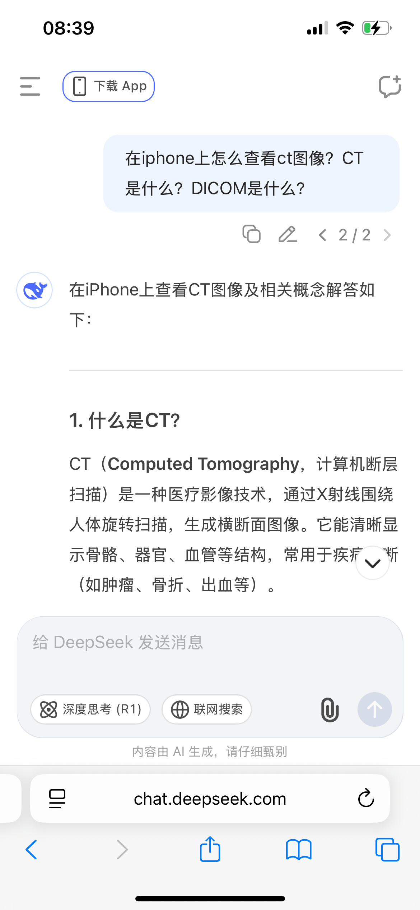

# 在 iPhone 上看 CT 图像

想查看 CT 图像，原始文件是 rar 压缩包。以下以在 iPhone 上查看 CT 图像为例。

## 一、在 iPhone 上安装查看 CT 图像的软件

在 iPhone 的`应用商店（App Store）`搜索 `dicom`，会出现很多可以查看 CT 图像的软件。以下以选择安装 `IDV - IMAIOS Viewer ` 为例，安装过程较为通用，此处从略。

 
  
<!-- 
 -->

## 二、下载 CT图像文件到 iPhone

以下以从微信下载文件为例。下载转发的 `xxx.zip` 文件。

- 点击 `用其他应用打开`（左图）
- 再点击 `存储到“文件”`（右图）
- 就放在 `我的iphone`，然后点击右上角的 `存储`。就完成下载了。

> 也可以下载 dicom.rar 压缩包到 iPhone。
> 1. 下载保存到 iPhone，过程和上面的过程，是一样的。
> 2. 需要再安装软件，解压缩 rar 压缩包。可以在 `应用商店（App Store）`搜索 `zip`，并看下介绍能处理 rar 压缩包的，然后安装。
> 3. 如果下载上述转发的 `xxx.zip`，则 iPhone 就可以解压缩，无需额外安装其他解压缩软件。

## 三、解压缩下载的 CT 图像文件

以下以解压缩转发的 `xxx.zip` 为例。

- 在 iPhone 上打开 `文件` app。
- 点击右下角 `浏览` 按钮，选择 `我的iPhone`，并找到刚刚下载的文件 `xxx.zip`（如下左图所示）
- 长按 `xxx.zip`，会出现一些选项，选择 `解压缩`。 zip文件就解压缩了，会生成一个和文件名一样的文件夹。（如下右图所示）

> 说明
> 1. RAR 压缩包，需要额外安装软件后解压缩。解压缩过程，和上述过程类似，此处从略。
> 2. 点击（不是长按） zip 文件，会自动解压缩。点一次，解一次，解开后的内容存放在和文件名一样的文件夹中。比如 aaa.zip，点一次，解开后放在 aaa 文件夹中；再点一次，放在 aaa1文件夹中；……。

## 四、查看 CT 图像

1. 在 iPhone 上打开刚安装的 `IDV - IMAIOS Viewer`。如果出现如下提示，选择`否`。

2. 点击左下角`学习档案`。初次使用一般会提示“您目前还没有任何考试”。点击右下方的`蓝色+圆圈`，将导入 CT 图像文件。（如下左图所示）
3. 选择`文件夹`（如下右图所示）

4. 找到刚解压缩的文件夹，然后点击右上角的`打开`按钮。（如下左图所示）
5. 点击右小角 `传输` 按钮。稍等数秒后，可以看到上传的进度。（如下右图所示）

6. 上传完成后可能出现如下错误。不用管，忽略就好。

7. 中间几个大框，双击某个，可进入如下右图查看详情。（如下左图所示）
8. 手指在屏幕上下滑动，可查看 CT 图像的变化。双击可回到如下左图。（如下右图所示）

## 附录：请教 AI，获得指导

先问问 deepseek，获得相关指导。也可以问问百度的文心一言、抖音的豆包、腾讯的元宝。

<!--  -->
<!--  -->

<!--  -->

问：在 iphone 上怎么查看 CT 图像？CT是什么？DICOM是什么？
得到如下回答：

### 1. 如何在 iPhone 上查看 CT 图像？

CT 图像通常以 DICOM 格式存储，可通过以下方法在 iPhone 上查看：

**方法一：使用专用 DICOM 查看器 App**

- 推荐应用：
  - Radiant DICOM Viewer（免费，专业且易用）
  - DICOM Viewer PRO（付费，高级功能）
  - ezDICOM（免费基础版）

- 操作步骤：

  1. 从医院或医疗机构获取 CT 的 DICOM 文件（如光盘、U盘或在线下载）。
  2. 将文件通过邮件、云存储（如 iCloud Drive、Google Drive）或 AirDrop 发送到 iPhone。
  3. 在 iPhone 上用上述 App 打开 DICOM 文件即可查看。

**方法二：通过医疗机构的患者门户**

许多医院提供患者端 App（如 MyChart），可直接登录查看自己的影像报告和图像。

**方法三：转换为普通图片格式**

若仅需简单查看，可请医生将 CT 关键图像导出为 JPEG/PNG 格式，通过相册打开（但会丢失 DICOM 的层厚、测量等元数据）。

### 2. CT 是什么？
- **全称**：计算机断层扫描（Computed Tomography）。
- **原理**：通过 X 射线围绕人体旋转拍摄多角度图像，经计算机重建为横断面（切片）图像，可显示骨骼、器官、血管等细节。
- **用途**：诊断肿瘤、骨折、出血、感染等疾病，比普通 X 光更精细。

### 3. DICOM 是什么？
- **全称**：医学数字成像与通信标准（Digital Imaging and Communications in Medicine）。
- **作用**：
  - 医学影像（CT、MRI、X光等）的**通用存储格式**，包含图像数据及患者信息、拍摄参数等元数据。
  - 确保不同设备、医院之间的影像兼容性。
- **特点**：
  - 文件扩展名通常为 .dcm。
  - 支持多层图像（如一套 CT 包含数百张切片）。
  - 可用专业软件进行三维重建、测量等操作。

### 注意事项
- 隐私保护：DICOM 文件包含敏感医疗信息，传输时需加密或使用安全渠道。
- 专业解读：CT 图像需由放射科医生分析，自行查看仅作参考。

## 
